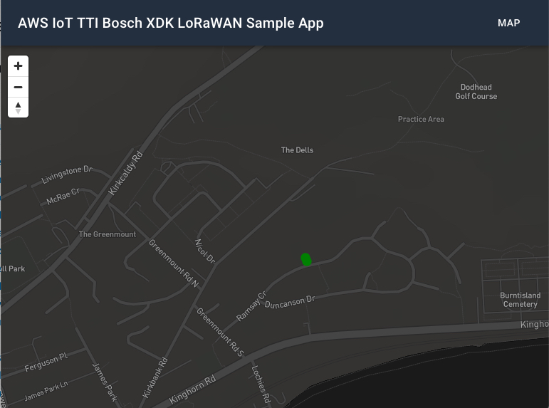
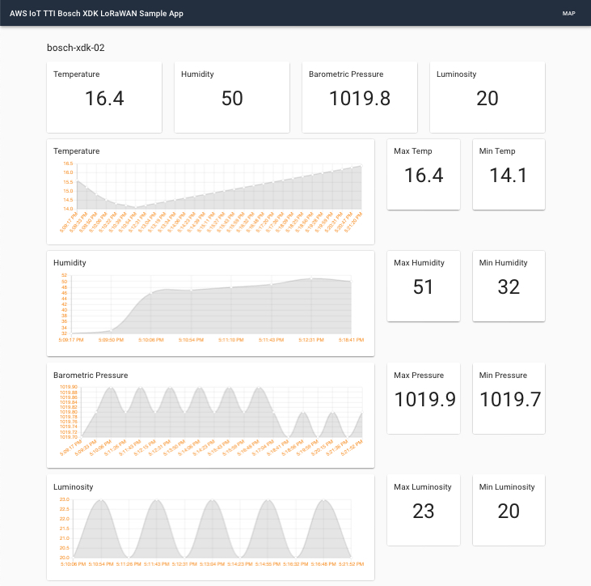
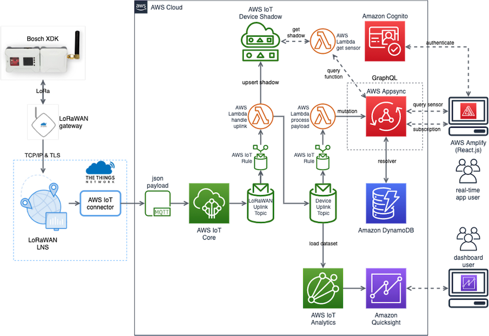
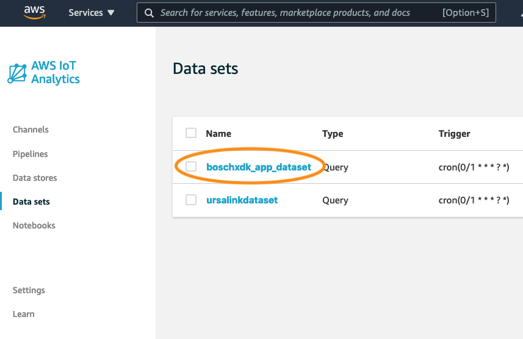
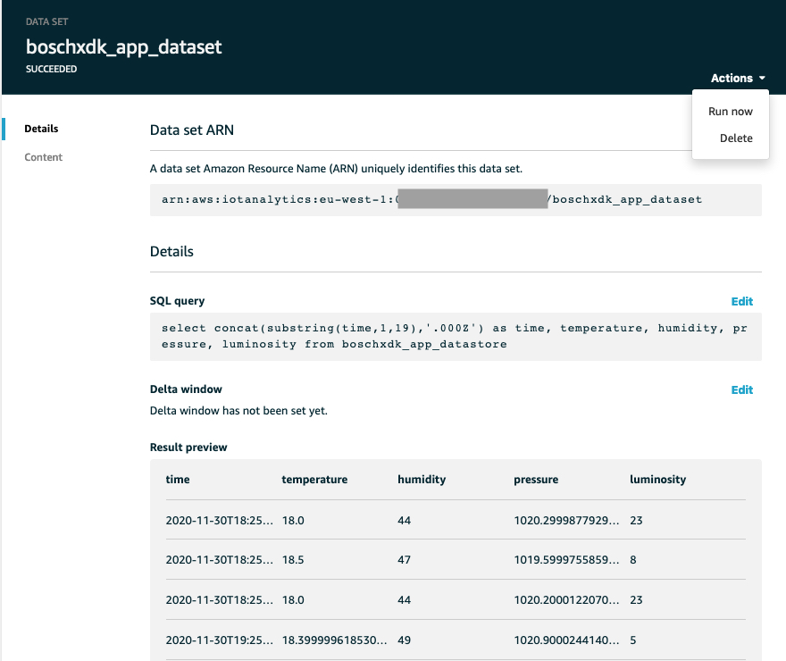
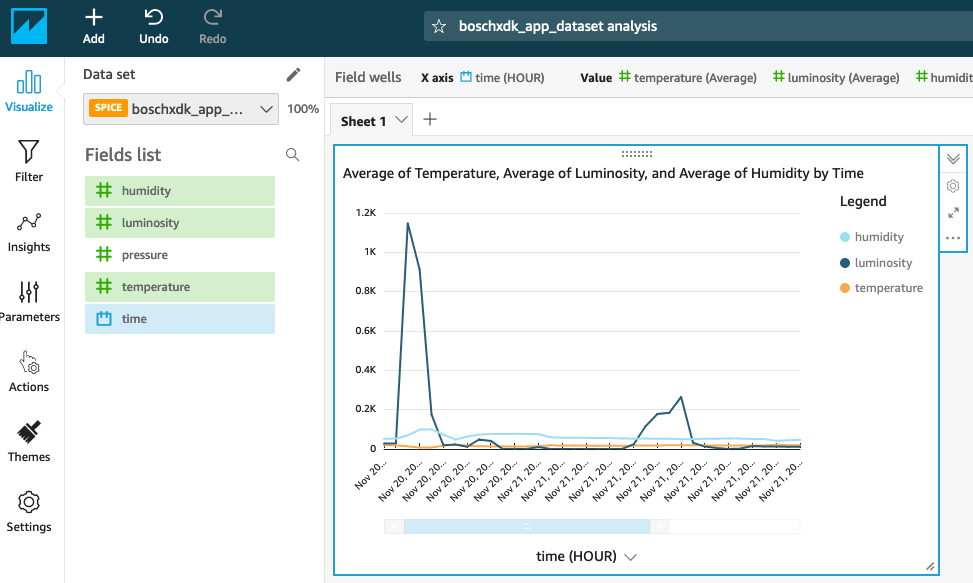

# aws-iot-lora-bosch

This application is a starter web application dashboard that demonstrates receiving real-time updates from one or more Bosch XDK devices. The solution is built with React, AWS AppSync, and AWS IoT Core technologies.

The application is a modified version of an AWS IoT sample application written by David Moser, which is available here: [aws-appsync-iot-core-realtime-dashboard](https://github.com/ttiawssamples/webinar-2020-12)



The sensors are represented as the colored dots. Their color will turn green as realtime data is received.

Click on a sensor to view the detailed values received in realtime from that specific sensor.



## Architecture



1. The LoRaWAN-enabled sensors in this application are connected via. The sensors are registered as _Things_ in IoT Core and publish random values to the Cloud on a configurable frequency. Metadata about each sensor, such as its geolocation, is stored in a _Thing Shadow_.

2. Rules in IoT Core subscribe to the message topic and forward the JSON payload to a Lambda function and the IoT Analytics pipeline.

3. The Node.js Lambda function executes a GraphQL mutation in AppSync. The mutation saves the sensor's value in DynamoDB and broadcasts the value in real-time to the web dashboard. The Lambda function uses an IAM role and policy to obtain permissions to interact with AppSync.

4. The React web dashboard application is written in TypeScript and subscribes to the AppSync sensor subscriptions. When new values are received, a map is updated in real-time to reflect the new sensor values. The application uses Cognito to authenticate users and allow them to perform the AppSync subscription.

5. The QuickSight dashboard generates charts and reports for Business Intelligence functions using data from the IoT Analytics timeseries optimized datastore.

## Getting Started

### **Prerequisites**

1. An AWS account in which you have Administrator access.

2. [Node.js](https://nodejs.org/en/download/) (^10.0) with NPM (^5.2)

3. [Amplify CLI](https://aws-amplify.github.io/docs/) (^4.21.1).

4. A [Mapbox](https://www.mapbox.com/) account with a free _Default Public Access Token_

5. A [Bosch XDK device](https://developer.bosch.com/web/xdk/overview) with LoRaWAN add-on module

6. [Bosch XDK Workbench](https://developer.bosch.com/web/xdk/downloads) installed on your computer

7. A cloud or self-hosted enterprise edition of [The Things Stack](https://thethingsstack.io/getting-started/)

8. A LoRaWAN gateway configured in your Things Stack. [Instructions here](https://thethingsstack.io/gateways/adding-gateways/)

After you have installed and configured Amplify, take note of the AWS profile you selected during the configuration. If you created a profile other than **default**, you will need the profile name for later steps in the deployment.

### **Installing**

If you run into issues installing or configuring anything in this project please checkout the [Troubleshooting](#troubleshooting) section below.

**Clone this code repository**

```
$ git clone https://github.com/ttiawssamples/webinar-2020-12.git
```

**Switch to the project's web folder for the Bosch XDK app**

```
$ cd webinar-2020-12/aws-iot-lora-bosch/web
```

**Install the web app's Node.js packages**

```
$ npm install
```

**Initialize your Amplify environment**

```
$ amplify init

? Enter a name for the environment: mysandbox
? Choose your default editor: [select your favorite IDE]
? Do you want to use an AWS profile? Yes
? Please choose the profile you want to use: default
```

When you select your profile, make sure to select the same profile you used when configuring Amplify.

Amplify will then begin to provision your account for the project deployment.

Once your account has been provisioned, entering the 'amplify status' command will show you the resources Amplify will create in your account:

```
$ amplify status

Current Environment: mysandbox

| Category     | Resource name        | Operation | Provider plugin   |
| ------------ | -------------------- | --------- | ----------------- |
| Auth         | iotdashboardbce44907 | Create    | awscloudformation |
| Api          | iotdashboard         | Create    | awscloudformation |
| Function     | listsensors          | Create    | awscloudformation |
| Function     | getsensor            | Create    | awscloudformation |
| Function     | createsensorvalue    | Create    | awscloudformation |
| Iotrule      | createsensorvalue    | Create    | awscloudformation |
| Iotanalytics | batch                | Create    | awscloudformation |
```

**Deploy the app infrastructure to your AWS account**

```
$ amplify push

? Do you want to update code for your updated GraphQL API (Y/n) Y

? This will overwrite your current graphql queries, mutations and subscriptions Y
```

You will then see a series of output messages as Amplify builds and deploys the app's CloudFormation Templates, creating the app infrastucture in your AWS account.

Resources being created in your account include:

- AppSync GraphQL API
- DynamoDB Table
- Cognito User Pool
- Lambda Functions (3)
- IoT Rule
- IoT Analytics

**Configure Mapbox API key**

This application uses maps from [Mapbox](https://www.mapbox.com/) to display the sensor locations. You must create an account and request a free **_default access token_**. Once you have the token, update the **_src/settings.json_** file with the token value.

**_src/settings.json_**

```
{
    "mapboxApiAccessToken": "your-token-here"
}
```

## Configure your TTI Application

This assumes you have already set up a LoRaWAN gateway linked to your TTI Account

**Add a new Application**

**Create an API Key for the device**

**Add a new device**

**Add an AWS Pub/Sub integration**
Follow the [instructions here](https://thethingsstack.io/integrations/aws-iot/default/deployment-guide/)

## Configure your XDK Sensor

**Create a new LoRaWAN sample project in your XDK Workbench environment**

**Set the App Key and App EUI in the sample code**

## Run the Web App

**Start the web app**

Switch back to the terminal window pointing to the **web** folder and run:

```
$ npm start
```

This will launch the application in your machine's default web browser.

**Sign-up and Sign-in**

The web app requires users to authenticate via Cognito. The first screen you will see is a logon screen. Click the **Create account** link and create a new account using your email address.

Cognito will then email you a confirmation code. Enter this code into the subsequent confirmation screen and logon to the app with your credentials.

**Use the Web App**

You should now see a screen similar to the one at the top of this guide. If you look at the terminal window running the sensor app, you shoud see the values being published to the Cloud reflected in the web app's sensor gauge in real-time.

From the initial map screen, click on a sensor to navigate to the sensor's detail page.

## Build the QuickSight BI Dashboard

Sensor data has been transmitted to both the real-time dashboard and IoT Analytics. We will now use IoT Analytics to build a BI dashboard using **QuickSight**.

Logon to the AWS Console and navigate to the **IoT Analytics** service and select **Data sets** from the menu.

Select the **boschxdk_app_dataset**



From the **Actions** menu select **Run now** to refresh the data set.



From the AWS Console navigate to the AWS QuickSight service in the region you are working in.

If you have not registered for QuickSight in your account follow these instructions to configure the service:

- Enroll for standard edition (if you have not used it before)
- Click on your login user (upper right) -> Manage QuickSight -> Account Settings -> Add and Remove -> Check IoT Analytics -> Apply
- Click on QuickSight logo (upper left) to navigate to home page
- Change the region to your working region

From the QuickSight menu:

- Select New Analysis -> New data set -> Choose AWS IOT Analytics
- Select an AWS IoT Analytics dataset to import - Choose **boschxdk_app_dataset**
- Click Create data source -> Visualize
- Select items from the **Field List** to visulaize
  - Choose time for Y axis and select an Aggregation period, e.g. HOUR
  - Choose all the sensor readings for Value axis
  - Choose average from Value drop down



## Cleanup

Once you are finished working with this project, you may want to delete the resources it created in your AWS account.

From the **web** folder:

```
$ amplify delete
? Are you sure you want to continue? (This would delete all the environments of the project from the cloud and wipe out all the local amplify resource files) (Y/n)  Y
```

## Troubleshooting

**Installing Amplify**

```
$ npm install -g @aws-amplify/cli
```

If you receive EACCES permisisons errors, make sure your system is setup properly to install global packages. See this [Guide for options](https://docs.npmjs.com/resolving-eacces-permissions-errors-when-installing-packages-globally).

## License

This sample code is made available under a modified MIT-0 license. See the LICENSE file.
